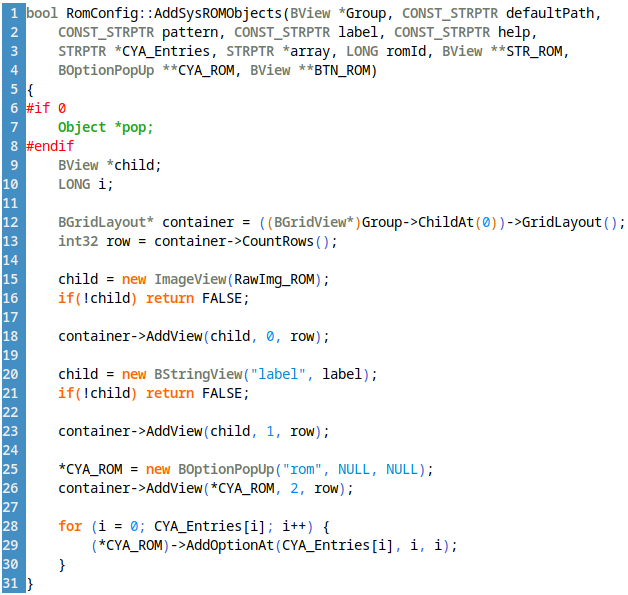
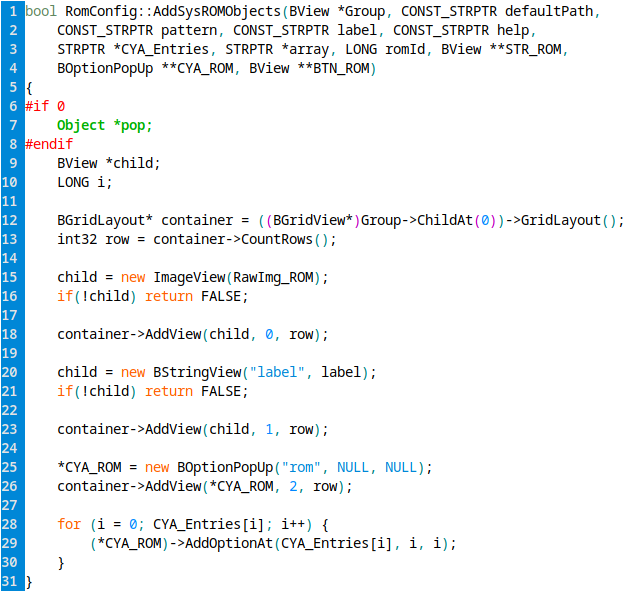

Improved vim syntax highlighting for vim
========================================

What it is
----------

For a very long time I was not quite happy with the syntax highlighting in vim
for C code. That was until I met JC, a colleague who had developped a much
better syntax file which I quickly adopted and installed on all my machines.

Unfortunately his work was based on an older vim version from 1998.
Today with the latest vim update, syntax was not working anymore. So I finally
took a deeper look about how this works, and extracted the needed bits to make
this a separate file that can be added to the existing syntax, without having
to redo everything.

What it does
------------

The main change is to detect and highlight types. The following cases are detected:
- Variable declarations
- Functions return type
- Function parameters (in declaration and definition)
- C and C++-style casts
- C++ "new" operator

Another change is colorizing the parentheses of if, while, and for in the same
color as the keyword (but this overrides rainbow parentheses so I'm not sure
if it should be kept this way).

Ideally, other parts of the highlighting will be left unchanged, but this
part is not working perfectly yet.

How to use it
-------------

Put c.vim and cpp.vim in your **.vim/after/syntax/** directory. That's all.

This script uses the standard colors for highlighting (mainly cType) so you
keep all your colorscheme and customizations when you install it.

**Do not put this file in .vim/syntax**. It is not a complete syntax definition for C and C++.
It only tweaks a few things in the existing syntax.

How does it look
----------------

Here is a side by side comparison, with and without c.vim:

 

Of course it also works in C++ (and in non-dark mode):

 

How to debug it
---------------

At the end of each file there are some examples of highlights. Remember that:

- These only set guibg, so they are visible only in gvim. You can start a console vim to see the endresult, and a gvim to see what's matched with which rule
- They set the background color, which should be quite easy to notice no matter what colorscheme you're using
- Add or remove rules there depending on what you're debugging
- To refresh the syntax, use :set ft=c (or cpp). The syntax file will be reloaded and all the changes you made are applied live
- Make sure to disable rainbow parentheses or similar, they interact badly with the custom parentheses matches used in this syntax (do they always? are some implementations better than other?)
- http://www.drchip.org/astronaut/vim/doc/hilinks.txt.html is very useful to understand how things are matched (it shows the matching in the statusbar)
